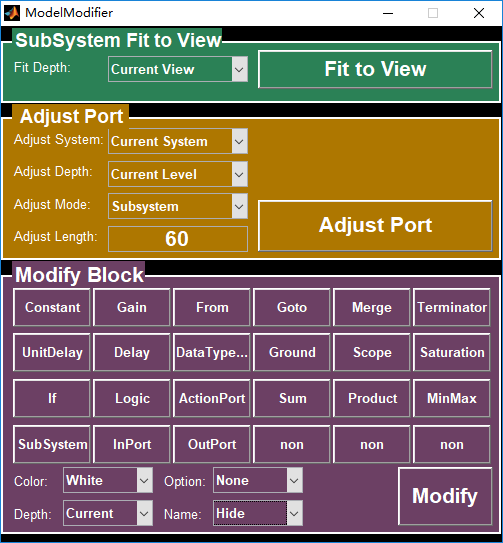

# Simulink Model Modifier
This is a script for modifying `Matlab/Simulink` models. It depends on the api supported by `Matlab` and is written with `Matlab/GUI` module. 

## Install
Copy `ModelModifier.fig` and `ModelModifier.m` to your `Matlab/Simulink` workspace.

## Usage
- Open the model you want to modify
- Run `ModelModifier.fig` from `Matlab` and choose the feature to use.

## Feature
### Fit to View
Set current/all level's `SubSystem` to `Fit to View` mode.

## Adjust Port
Set all the input/output ports of `Subsystem` aligned automatically. Options:
* Adjust System
  + Current System: current system 
  + Manual Input: input system manually
* Adjust Depth
  + Current Level: current level
  + Children Level1: children level 1
  + Children Level2: children level 2
  + children Level3: children level 3
* Adjust Mode
  + SubSystem: subsystem
  + Model Reference: reference model
* Adjust Length: the distance to system
## Modify Block
Set all the attributes of the system the same, like color, size and name.

